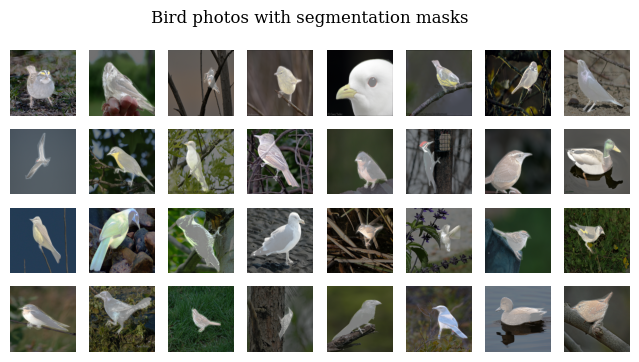
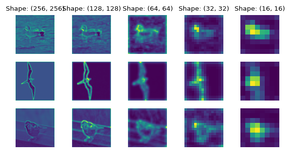
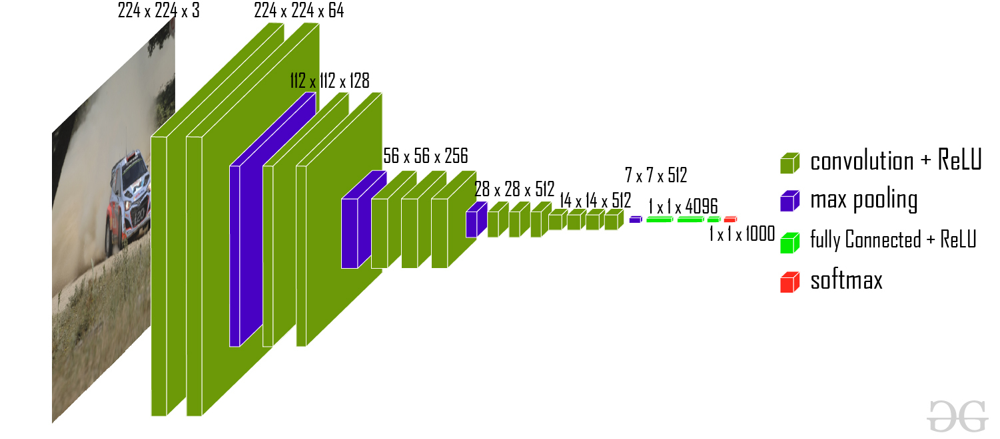

# Caltech Birds 2011, Image Segmentation

     

This notebook shows one method of building a segmentation model,
with performance and efficiency as a priority (a constraint, honestly)

## Explaining the UNet model

---

The way we would start to build a model of this kind would be to
take ideas from the literature, and UNet is perhaps the most popular
segmentation architecture, borne after reaching performace that eclipsed
the previous SOTA fully convolutional networks.

The architecture of UNet is shown below (thank you to Jidan Zhong and her 
[website](https://jidan.sinkpoint.com/MRI_ventricle_UnetCNN/) for the image.)

     

This is actually a very straight foreward model. Three things are happening here

1. *Feature extraction*

Features are being extracted and distilled by convolutions and pooling layers,
just like they would be in a typical classification model. **In fact**, you can build
a segmentation model like this with a *pre-trained* classification model as a base for the encoder.

2. *Downsampling*

Nothing technical here, just convolutions and pooling layers with 4X4 kernels and 2x2 strides, 
which compress the size of an image by two.

3. *Upsampling*
 
The interesting part of this model is the upsampling process, which is accomplished
primarily using `Conv2DTranspose`, a layer that takes in a pixel and convolutions
and tries to "reverse engineer" what the pixel values were that preceeded downsampling

One other interesting thing is shown here. As one might guess from the graphic,
at each upsampling stage we combine the tensor output from a stage in our model
with the same dimensions, creating the "U"-like shape which is the obvious namesake
for this network.

     

### How we built it

As is typical, the greatest challenge to overcome here is computational time complexity.
If I'm recalling correctly, I think the ETA for 1 epoch of training for the ~23M parameter network
was over 9 hours on my personal computer. It would be wise to SSH into an EC2 or equivalent
cloud computing instance if you are on a CPU-only machine, although a script of XLA optimization
options is included with the python code, as some processors can make use of XLA.

The principal way we avoided cost was by using a pretrained model from the
[Keras Applications module](https://www.tensorflow.org/api_docs/python/tf/keras/applications),
specifically the **VGG16** network from [Very Deep Convolutional Networks](https://arxiv.org/abs/1409.1556)
was used in this case.

#### VGG16

     

###### Forgive me for interjecting

But it is possible that a ResNet architecture would be optimal for the data in question, considering
that the size of each picture's bird varies significantly. 
In a classification context, it would be ideal to employ a model designed with residual blocks,
as they are known for being more robust to scaling transformations due to the breadth of kernel sizes at step.

It isn't clear if the difference in this context is dramatic (or even able to be perceived.)

###### Note

This repo in unfinished, check back soon if you'd like

#### Training

Ended early due to resource constraints (ETA 9 hours for one epoch...)

Looking forward, there is a lot left on the table in terms of performance tuning:

#### Structural ways to reduce time complexity
- Build a smaller model with less parametes
- Use smaller images 

#### Engineering ways
- Use pre-trained encoder to save outputs, and train on that data using decoder only,
 this way you can take the gradient w.r.t. only the weights you want to update
- Fine-tune the number of parallel calls, data interleaving, batch size, prefect and
other parameters that can optize model training
- Convert to script, take advantage of XLA/the JIT (or "just-in-time") compiler